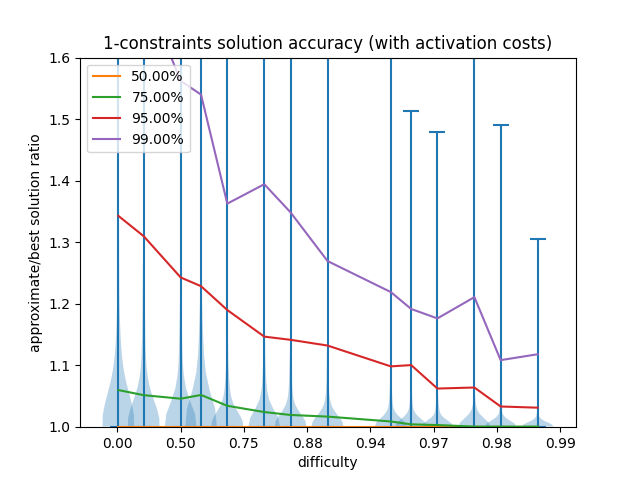

# Instructions

Create a virtual env for processing the results in python
```
ptyhon3 -m venv venv
source venv/bin/activate
pip install -r python/requirements.txt
```

Compile the project
```
make
```

# Fixed Charge Network Flow Problem

The Fixed Charge Network Flow Problem (FCNFP) is defined as a Network Flow
problem for which there is an additional cost for the activation of the arcs, ie. a
flow `x` on arc `a` has a cost `C(x) = c*x + f*Theta(x)`, where `Theta(x)`
is zero if `x` is zero or 1 otherwise, and the values `c` and `f` are
non-negative numbers.

The FCNFP can also be stated as follows
```
given a graph G(N,A)

minimize
    sum_{a in A} x[a] * c[a] + f[a] * y[a]

such that
    0 <= x[a] <= u[a], for all a in A // capacity constraints
    
    y[a] = {0, 1}, for all a in A // y[a] are either 0 or 1
    
    sum_{a outgoing from n} x[a] - sum_{a incoming to n} x[a] = b[n], for all n in N // flow conservation
    
    0 <= x[a] <= y[a] * u[a], for all a in A // y[a] is 1 if and only if x[a]>0

```

This problem is NP-Hard, this can be proven by noticing the decision problem
*Minimum Edge-Cost Flow* (ND32 in [1])
reduces to our current problem with zero proportional costs, `c[a]=0`.

However, we usually don't need to solve the problem exactly and some approximate
solutions exist.

For example Kim-Pardalos [2] describes a *dynamic slope procedure* that produces
approximate solutions by linearizing the problem over a sequence of iterations.

We have implemented Kim-Pardalos's method and tested it with a random set of
testcases. At first with `|N|=30` and `|A|=300` (TODO: investigate how the accuracy of
the solutions evolve with increasing problem size).
We conjeture that the more relevant the fixed costs are the more difficult will
be for the approximate method to find the optimal solution, therefore we
produced a set of random test cases assigning `f[a]` from an uniform PDF in the
range `[0,1000000]` and capacities of the arcs `u[a]` in the range `[0,10000]`
while the proportional costs `c[a]` where extracted from an uniform PDF in
the range `[0,2^k]` with `k` varying in different test cases from 0 to 20.

Results are shown below in a scatter plot.
For each test case there are two points: one corresponding to the dynamic slope
procedure and the other using a one time linearization of the problem.
The X coordinate is the ratio of the mean value of `f[a]` and the mean value of
`c[a]` multiplied by the flow demand in the problem as a measure of how much do
we deviate from a purely linear problem, ie. the smaller the X the more
quasi linear is the problem and the bigger the X the more important are fixed
costs values and the harder the problem gets. In the Y axis we have
the optimal cost as computed by the approximate method divided by the
optimal cost for the exact solution.


In general the dynamic slope procedure produces better results than the
*fixed slope* (one time linearization). For quasilinear problems (`X<<1`)
both procedures converge to the optimal solution while for mildly
non-linear case (`0.1<X<1`) the fixed slope tends to deviate from the optimal
solution and eventually produce solutions with costs exceeding twice as much
as the exact solution for highly non-linear problems `X>1`.
While the dynamic slope in most cases is able to find a solution that does not
exceed the 50% cost of the optimal solution even in highly non-linear regimes.

To generate the data I used the following command line instructions
```bash
bash generate-fcnfp.sh | tee dataset | example/ex-fcmcf-approx-validate | tee results | python scatter-plot-fcnfp.py
```

# Payment optimization as a Fixed Charge Network Flow Problem with additional constraints

A channel has several features the most relevant for a payment are
```
ppm: the proportional fee in parts per million
base_msat: the base fee
delay: htlc delay added in number of blocks
capacity: channel's capacity
L_low: lower bound on liquidity
L_high: higher bound on liquidity
prob_active: probability of being available to forward a payment
```

In our flow problem modeling we will adopt a minimum unit of flow named `u`
(`u` could be `1msat`, `1sat`, `100sat`, etc.), and for each channel `i` we will
associate the variables `x[i]` and `y[i]`:
```
x[i]: the flow that goes through channel i, the amount is x[i]*u
y[i]: 0 if and only if x[i]==0, and 1 if x[i]!=0
```

From a flow assignment we have identified several cost functions that are
usually relevant:

- the fee cost function in units of `msat`, ie. how much do we pay in fees
```
fee_cost_msat(x[i],y[i]) = base_msat * y[i] + proportional_msat * x[i]

where
    proportional_msat = ppm * 1e-6 * u/msat
```

- the delay cost, we don't want delay to be too big so that in case of force
  closure we can recover the funds in a reasonable time
```
delay_cost(x[i],y[i]) = base_delay * y[i]
```

- the probability cost (based on [3])
```
prob_cost(x[i],y[i]) = base_prob * y[i] + proportional_prob * x[i]

where
    base_prob = -k * log prob_active

    proportional_prob = - k * m/(b-a)

    k: is a constant arbitrary factor, we suggest it to be 1000 so that
    the minimum cost unit of 1 relates to a probability of 0.999 of success
    (cost = -log probability).

    b, a: the liquidity bounds scaled by u, ie. a = L_low/u and b = L_high/u

    m: an average slope, in the piecewise linearization of the channels (see [4])
    it takes the values 0, 1.38, 3.05 and 9.24
```

We define then a Min. Cost Flow problem with an objective function based on
probability cost, ie. minimize the probability cost function which is equivalent
to maximize the probability of success, while keep a bound on all other cost
functions.
```
given a graph G(N,A)

minimize
    sum_{a in A} proportional_prob[a] * x[a] +  base_prob[a] * y[a]

such that
    // capacity constraints
    0 <= x[a] <= u[a], for all a in A

    // y[a] are either 0 or 1
    y[a] = {0, 1}, for all a in A

    // flow conservation
    sum_{a outgoing from n} x[a] - sum_{a incoming to n} x[a] = b[n], for all n in N

    // y[a] is 1 if and only if x[a]>0
    0 <= x[a] <= y[a] * u[a], for all a in A

    // additional constraint, fee cost is bounded by Fee_msat
    Fee_msat >= sum_{a in A} proportional_msat[a]*x[a] + base_msat[a]*y[a]

    // additional constraint, delay is bounded by Delay_max
    Delay_max >= sum_{a in A} base_delay[a]*y[a]
```

A Min. Cost Flow Problem solver that handles fixed charge and additional
constraints can solve this problem and many more variations as long as they keep
this structure.

# First implementation of the Constrained Fixed Charge Network Flow Problem and Results

I have implemented a simple solver for this problem based on the existing solver
for the FCNFP as a subproblem. It uses Lagrangian relaxation of the extra
constraints adding them as extra terms to the objective function.
```
bool solve_constrained_fcnfp(const tal_t *ctx, const struct graph *graph,
			     s64 *excess, s64 *capacity,
			     const size_t num_constraints, s64 **cost,
			     s64 **charge, const s64 *bound,
			     const double tolerance,
			     const size_t max_num_iterations);
```

We have tested it with randomly generated graphs with 30 nodes and 100 arcs.
Also the arc's features were randomly generated, ie.
capacity: from 0 to 10'000, slope of the costs functions: 0 to 100,
and fixed charge (when requested): 0 to 100'000.

The generated random cases are classified according to their *difficulty*.
This quantity has been defined as the ratio between the smallest possible value
the cost function (for the extra features) can reach with the given supply/demand
constraints and the value of the constraint imposed on that feature.
```
    difficulty = smallest_cost/constraint
```
The difficulty tends to zero when the constraint goes to infinity and it can
practically be ignored. The difficulty tends to 1, the maximum value we can
reach, means that the constraint is almost equal the smallest value of the
feature's cost function. Increasing the difficulty we reduce the space of
feasible solutions.

## Testcases with 0 fixed charge (or activation cost)


## Testcases with fixed charge




To run these benchmarks
```
ACTIVATION_COSTS=N
N_CONSTRAINTS=2
bash generate-cfcnfp.sh ${N_CONSTRAINTS} ${ACTIVATION_COSTS} | tee constrained-fcnfp-n${N_CONSTRAINTS}${ACTIVATION_COSTS}.data | ./example/ex-constrained-fcmcf-validate | tee results-n${N_CONSTRAINTS}${ACTIVATION_COSTS} | python3 scatter-plot-cfcnfp.py ${ACTIVATION_COSTS}

ACTIVATION_COSTS=N
N_CONSTRAINTS=3
bash generate-cfcnfp.sh ${N_CONSTRAINTS} ${ACTIVATION_COSTS} | tee constrained-fcnfp-n${N_CONSTRAINTS}${ACTIVATION_COSTS}.data | ./example/ex-constrained-fcmcf-validate | tee results-n${N_CONSTRAINTS}${ACTIVATION_COSTS} | python3 scatter-plot-cfcnfp.py ${ACTIVATION_COSTS}

ACTIVATION_COSTS=N
N_CONSTRAINTS=4
bash generate-cfcnfp.sh ${N_CONSTRAINTS} ${ACTIVATION_COSTS} | tee constrained-fcnfp-n${N_CONSTRAINTS}${ACTIVATION_COSTS}.data | ./example/ex-constrained-fcmcf-validate | tee results-n${N_CONSTRAINTS}${ACTIVATION_COSTS} | python3 scatter-plot-cfcnfp.py ${ACTIVATION_COSTS}

ACTIVATION_COSTS=Y
N_CONSTRAINTS=2
bash generate-cfcnfp.sh ${N_CONSTRAINTS} ${ACTIVATION_COSTS} | tee constrained-fcnfp-n${N_CONSTRAINTS}${ACTIVATION_COSTS}.data | ./example/ex-constrained-fcmcf-validate | tee results-n${N_CONSTRAINTS}${ACTIVATION_COSTS} | python3 scatter-plot-cfcnfp.py ${ACTIVATION_COSTS}

ACTIVATION_COSTS=Y
N_CONSTRAINTS=3
bash generate-cfcnfp.sh ${N_CONSTRAINTS} ${ACTIVATION_COSTS} | tee constrained-fcnfp-n${N_CONSTRAINTS}${ACTIVATION_COSTS}.data | ./example/ex-constrained-fcmcf-validate | tee results-n${N_CONSTRAINTS}${ACTIVATION_COSTS} | python3 scatter-plot-cfcnfp.py ${ACTIVATION_COSTS}

ACTIVATION_COSTS=Y
N_CONSTRAINTS=4
bash generate-cfcnfp.sh ${N_CONSTRAINTS} ${ACTIVATION_COSTS} | tee constrained-fcnfp-n${N_CONSTRAINTS}${ACTIVATION_COSTS}.data | ./example/ex-constrained-fcmcf-validate | tee results-n${N_CONSTRAINTS}${ACTIVATION_COSTS} | python3 scatter-plot-cfcnfp.py ${ACTIVATION_COSTS}
```


# References

[1] Michael R. Garey and David S. Johnson. Computers and Intractability, a guide
to the Theory of NP-Completeness. ISBN 0-7167-1045-5.

[2] Dukwon Kim, Panos M. Pardalos. A solution approach to the fixed charge
network flow problem using a dynamic slope scaling procedure.
Operations Research Letters 24 (1999) 195-203.

[3] Rene Pickhardt, Stefan Richter. Optimally Reliable & Cheap Payment Flows
on the Lightning Network https://arxiv.org/abs/2107.05322

[4] https://lagrang3.github.io/2023-10-28-renepay-1
